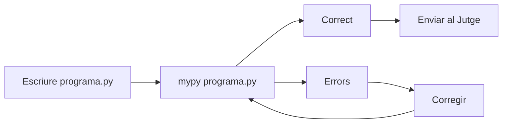

# 03 · Funcions, accions i tipus

## Funcions

Retornen un valor.

```python
def foo(x: int, y: int) -> int:
    return x + y
```

## Accions

```python
def bar(msg: str) -> None:
    print(msg)
```

No retornen cap valor, però poden executar altres funcions.

## Tipus

A partir d'ara ens esforçarem per indicar els tipus en els nostres programes.

### Recordatori

Tipus bàsics:

> `int`: nombre enter
>
> `float`: nombre real
>
> `bool`: valor booleà (True o False)
>
> `str`: text

Els tipus de les variables poden canviar, però les operacions que podem fer entre dues variables depèn del seu tipus (e.g. no podem sumar un enter i un text).

### Comprovar que els tipus concorden en el programa

Primer instal·lem el mòdul `mypy`, i li passem el programa que volguem comprovar:

```bash
pip install mypy
mypy programa.py
```

Posem per cas un programa on els tipus no concorden:

```python
import yogi

def foo(name: str, x: float) -> float:
    print(f"The value of {name} / 2 is {x/2}")
    return x / 2

def main() -> None:
    x = yogi.read(int)
    y = yogi.read(int)
    foo(x, y)

if __name__ == "__main__":
    main()
```

Ens genera el següent error:

```bash
mypy exemple-03_01.py
exemple-03_01.py:12: error: Argument 1 to "foo" has incompatible type "int"; expected "str"
Found 1 error in 1 file (checked 1 source file)
```

Haurem de corregir els tipus de les variables per tal de que quadrin:

```python
import yogi

def foo(name: str, y: float) -> float:
    print(f"The value of {name} / 2 is {y/2}")
    return y / 2

def main() -> None:
    x = yogi.read(str)
    y = yogi.read(float)
    y2 = foo(x, y)

if __name__ == "__main__":
    main()
```

I per fi obtenim:

```bash
mypy exemple-03_02.py
Success: no issues found in 1 source file
```

### Resumint

Per enviar programes al jutge comprovarem que els tipus concordin i seguirem el següent procés:


